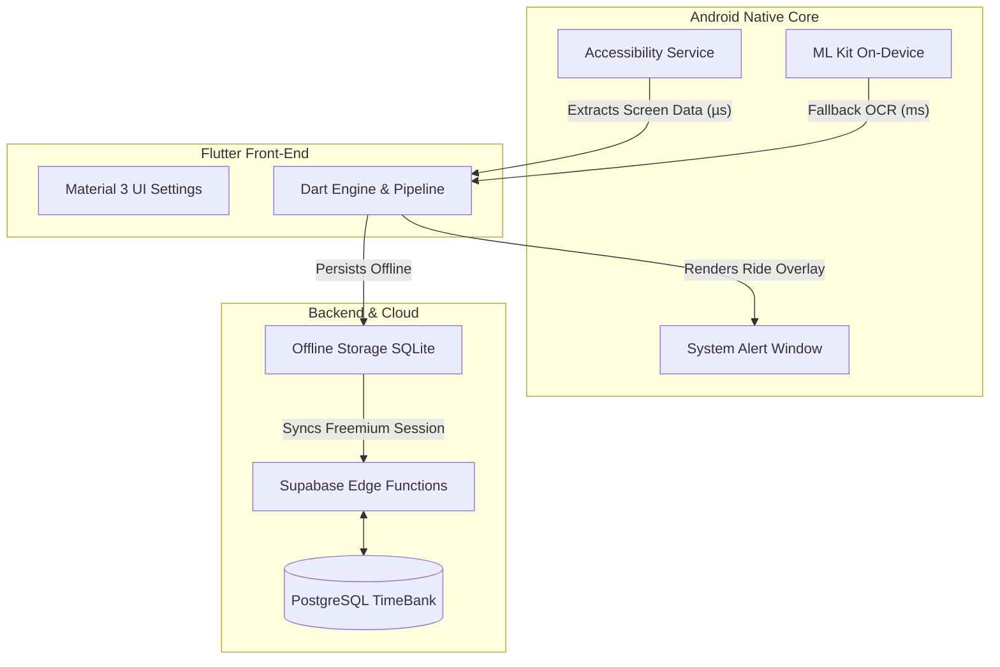

#  SmartCopilot Platform (Showcase)

### *Ecossistema de Otimização Dinâmica para Motoristas de Aplicativo*

  Uma solução <b>Natívio-Híbrida Full-Stack</b> que integra Serviços de Acessibilidade nativa Android, Visão Computacional (OCR)  
  e um robusto Backend Inteligente para transformar dados de corridas em ganhos reais em tempo real.

<!-- Badges Unificadas Front + Back -->

  
  
  
  

 

<!-- Links do Projeto -->

---

## 📖 Sobre o Projeto

Este repositório serve como **Vitrine Técnica (Showcase)** para o **SmartCopilot**, um software proprietário desenvolvido para automatizar a tomada de decisão para motoristas de aplicativos (Uber, 99, Indrive).

O sistema resolve a assimetria de informações enfrentada pelos motoristas na rua, interceptando cards de corrida em microssegundos (via Android Accessibility Services) e fornecendo análises precisas (R$/km, R$/hora, Zonas de Risco) numa interface **Flutter (Material 3)** flutuante e hiper-otimizada.

> ⚠️ **Nota:** *O código-fonte completo é privado. Este repositório demonstra a arquitetura, funcionalidades, stack tecnológica e o roadmap de desenvolvimento.*

---

## 📸 Visão Geral da Interface

  <!-- SUBSTITUA POR SEUS PRINTS REAIS NA PASTA ASSETS -->
  
   
  <em>Dashboard de controle e overlay inteligente analisando uma corrida em tempo real.</em>

---

## 🆕 Capacidades Recentes & Inovações

A arquitetura do SmartCopilot foi desenhada para operação **Zero-Latency/Offline-First**, garantindo que as avaliações de corrida ocorram localmente em milissegundos.

### ⚙️ Engenharia Nativa Android (Kotlin)
*   **Accessibility Service Profundo:** Monitoramento contínuo da árvore de elementos (DOM nativo) de aplicativos de transporte para extrair dados sem afetar a performance do device.
*   **Overlay Engine Avançado:** Renderização de janelas sobrepostas (System Alert Window) que reagem dinamicamente à tela de fundo.
*   **Gerenciamento de Energia & Background:** Serviços estabilizados (Foreground Services, Wakelocks) desenhados para não serem "mortos" pelas baterias agressivas das OEMs (Xiaomi, Samsung).
*   **Fallback Inteligente via ML (OCR):** Quando a árvore de acessibilidade é ofuscada pelas plataformas, o sistema captura a tela e a submete a extração óptica via Google ML Kit On-Device.

### 🎨 Frontend & App Arquitetura (Flutter)
*   **Motor de Filtros de Alta Performance:** Avaliação instantânea (R$/km, HR) de cada corrida contra dezenas de filtros definidos pelo usuário (Destinos Indesejados, Limite Mínimo, Nota do Passageiro).
*   **Design System Material 3:** Interface limpa, responsiva e com feedback tátil.
*   **Modularização Baseada em Features:** Clean Architecture aplicada ao Dart, separando *Core*, *Features* e *Services* para manutenção escalonável.
*   **Gestão de Estado Reativa:** Integração sem atrito com o Kotlin Bridge para comunicar a detecção de chamadas diretamente aos Controllers Dart.

### 🧠 Backend, Analytics & Freemium Edge
*   **Assinaturas e Controle de Tempo:** Motor distribuído de controle "Freemium" que provisiona horas de funcionamento para testes controlados via Supabase Edge Functions.
*   **Metrificação (TimeBankController):** Monitoramento persistente de sessões e engajamento.

---

## 🛡️ Destaques Técnicos & Segurança

### Nativo & Dart
*   **Integração Plataforma Completa:** Uso avançado de *MethodChannels* e *EventChannels* para bidirecionalidade assíncrona.
*   **Isolates & Background:** Tarefas pesadas (ex. Parsing de Corridas complexas via Expressões Regulares) rodando fora da UI-Thread (Main Isolate).
*   **Resiliência a Ofuscação:** Parsers projetados para reagir a variações e Testes A/B na interface do Uber e 99.

---

## 🚀 Roadmap e Próximos Passos

O desenvolvimento atual foca na maturidade de Automação para os motoristas, evoluindo de uma ferramenta analítica para uma "Mão Auxiliar".

### 🚗 Automação de Corridas 
- [ ] **Macro Actions (Auto-Aceite):** Comando nativo de clique programático (`ACTION_CLICK`) para aceitar instantaneamente corridas que atinjam nota 10/10 no algoritmo.
- [ ] **Auto-Recusa Inteligente:** Fechar e dispensar chamadas péssimas, limpando a tela para aumentar a segurança viária do motorista.
- [ ] **Expansão de Parsers:** Aumento de precisão OCR para modelos de aparelhos específicos.

### 🔐 Plataforma & Monetização
- [ ] **Gateway de Pagamento Integrado:** Subscrições in-app habilitadas de forma orgânica.
- [ ] **Fleet Analytics:** Dashboard remoto via Web (React/Flutter Web) para frotistas que quiserem alugar o sistema.

---

## 🏗️ Arquitetura de Alto Nível (System Design)

Abaixo, a representação simplificada do fluxo de dados e dos módulos do sistema, desenhada para ilustrar a interação entre o Flutter, o Core Nativo do Android e o Backend Serverless, sem expor a lógica restrita.

---

## 🛠️ Stack Tecnológica Completa

| Categoria | Tecnologias Principais | Detalhes |
| :--- | :--- | :--- |
| **Cross-Platform** | **Flutter** | Material 3, MethodChannels, Dart 3 |
| **Core Nativo** | **Kotlin / Java** | Android AccessibilityService, Overlay Services, ML Kit |
| **Local Storage** | **SharedPrefs/SQLite** | Persistência ultra-rápida offline-first |
| **Backend & Gen** | **Supabase** | Edge Functions, PostgreSQL remote |

---

## 📚 Documentação Técnica Aprofundada

Para explorar mais a fundo a arquitetura e as soluções de engenharia do SmartCopilot, consulte os documentos abaixo:

- [Diferenciais Técnicos](docs/diferenciais.md): Detalhes sobre a arquitetura híbrida, overlay nativo e resiliência offline.
- [Ferramentas Utilizadas](docs/ferramentas.md): Ecossistema de desenvolvimento, DevOps, QA e Analytics.
- [Tecnologias do Sistema](docs/tecnologias.md): Stack detalhada do aplicativo (Dart/Kotlin) e backend (Supabase).

---

## 📄 Licença e Termos de Uso

Este é um software **proprietário**. O código-fonte principal é restrito aos desenvolvedores e proprietários do projeto. Este repositório destina-se apenas a portfólio e demonstração de arquitetura.

- **Status do App:** Atualmente em fase de Testes Fechados na Google Play Store. O link da loja será substituído quando o lançamento oficial ocorrer.
- **Termos e Condições:** A cópia, distribuição não autorizada, comercialização ou engenharia reversa do código-fonte ou dos binários do SmartCopilot é estritamente proibida e passível de medidas legais. O uso do aplicativo está sujeito aos termos aceitos no momento do cadastro.

---

## 👨💻 Suporte & Contato

**Suporte Oficial do App:**
 

  

**Robert Ferreira (Desenvolvedor)**
 
*Engenheiro de Software Full-Stack | Especialista em Mobile Nativo & Cross-Platform*

 

  
© 2026 Robert Ferreira. Todos os direitos reservados.

