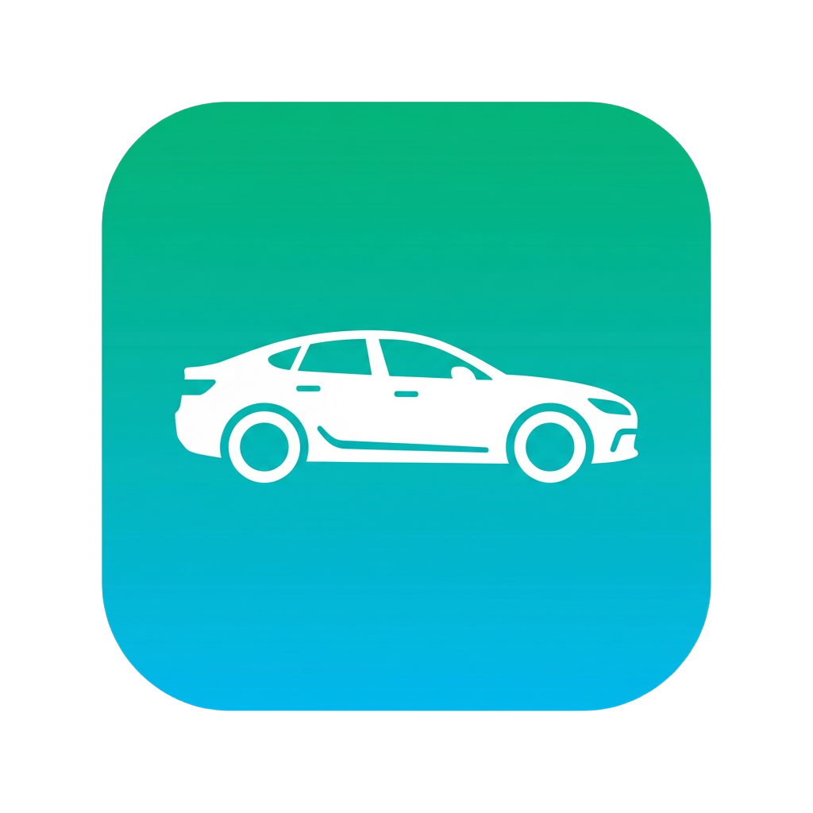
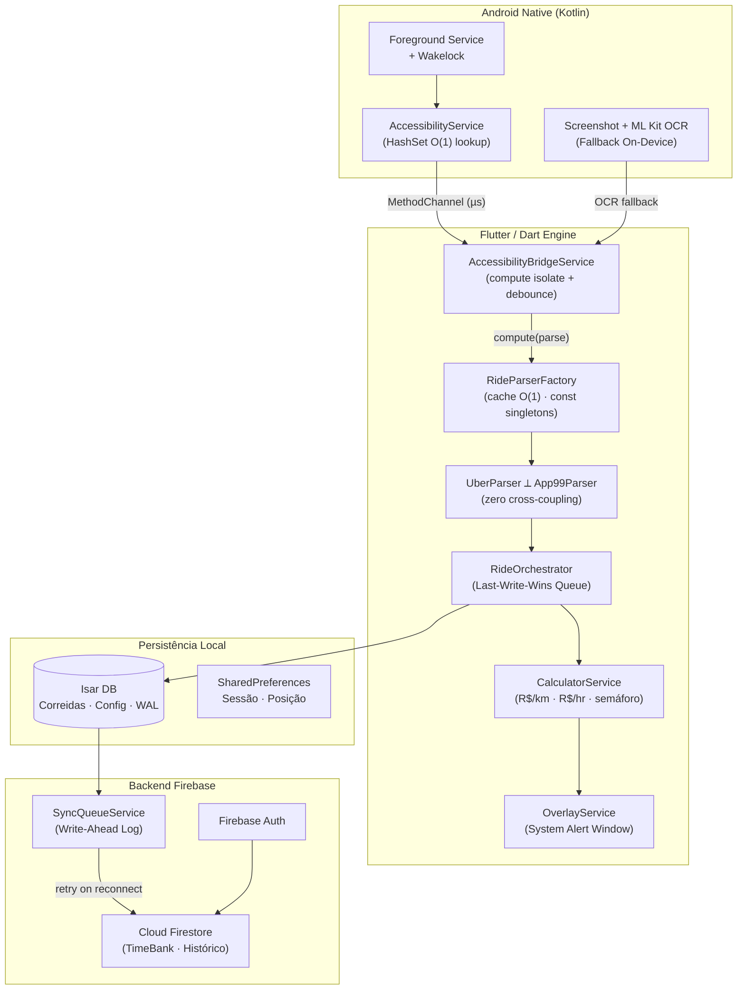

#  SmartCopilot Platform (Showcase)

### *Ecossistema de Otimização Dinâmica para Motoristas de Aplicativo*

  Uma solução <b>Nativo-Híbrida Full-Stack</b> que integra Serviços de Acessibilidade nativa Android, Visão Computacional (OCR On-Device)  
  e uma arquitetura orientada a resiliência para transformar dados de corridas em decisões em milissegundos — 100% offline.

<!-- Badges -->

  
  
  
  
  
  

 

<!-- Links do Projeto -->

---

## 📖 Sobre o Projeto

Este repositório é a **Vitrine Técnica (Showcase)** do **SmartCopilot**, um software proprietário desenvolvido para automatizar a tomada de decisão para motoristas de aplicativos (Uber, 99).

O sistema resolve a assimetria de informações enfrentada pelos motoristas em tempo real: intercepta os cards de corrida via Android Accessibility Services, avalia métricas críticas (R$/km, R$/hora, nota do passageiro) e exibe um overlay flutuante com semáforo de rentabilidade — tudo processado **localmente, sem depender de rede**.

> ⚠️ **Nota:** *O código-fonte completo é privado. Este repositório demonstra a arquitetura, funcionalidades, stack tecnológica e o roadmap de desenvolvimento.*

---

## 📸 Visão Geral da Interface

  
   
  <em>Dashboard de controle e overlay inteligente analisando uma corrida em tempo real.</em>

---

## ⚙️ Capacidades Técnicas & Inovações

### Android Nativo (Kotlin)

- **Accessibility Service Profundo:** Monitoramento contínuo da árvore de elementos do sistema Android (DOM nativo) dos apps de transporte, com lookup de pacotes em O(1) via `HashSet` para mínimo consumo de CPU.
- **Roteamento Isolado por Plataforma:** `UberService` e `99Service` são processados por pipelines completamente independentes — uma mudança de layout do Uber não afeta o parser da 99.
- **Overlay Engine Avançado:** Renderização de janelas sobrepostas (System Alert Window) que reagem dinamicamente à tela do driver app via `flutter_overlay_window`.
- **Foreground Service + Wakelock:** Proteção ativa contra o gerenciamento agressivo de bateria das OEMs (Xiaomi, Samsung) para garantir monitoramento contínuo em plantões longos.
- **OCR On-Device como Fallback:** Quando a árvore de acessibilidade é ofuscada por A/B testing das plataformas, o sistema captura a tela e submete ao Google ML Kit — 100% local, zero latência de rede.

### Arquitetura de Software (Flutter / Dart)

- **Strategy Pattern para Parsers:** Cada plataforma tem seu próprio parser (`UberScreenParser`, `App99Parser`) que implementa `BaseRideParser`. Zero acoplamento cruzado. Novos apps (inDrive, etc.) são adicionados sem tocar no código existente.
- **Cache O(1) no Factory:** `RideParserFactory` mantém instâncias `const` (singleton) com resolução cacheada — zero alocação de objeto por evento de acessibilidade.
- **Background Isolates para CPU-Bound:** Decode e crop de imagem (`img.decodeImage`, `img.copyCrop`) rodam via `compute()` em background isolate, liberando a main thread para manter 60fps no overlay.
- **Last-Write-Wins Queue no Orquestrador:** `RideOrchestrator` usa uma fila com capacidade 1 — nunca descarta uma corrida silenciosamente durante a exibição do card atual.
- **Write-Ahead Log (WAL) Local:** Operações Firebase são persistidas no Isar antes de tentar a rede. Em caso de falha (3G fraco, zona sem sinal), são retentadas automaticamente na próxima sessão — zero perda de dados.
- **Circuit Breaker de Rede:** Toda chamada Firebase passa por `withNetworkResilience()` com timeout configurável e fallback gracioso, projetado para a realidade de motoristas em áreas de sombra de sinal.
- **Design System Material 3:** `SemanticColors`, `AppTypeTokens` e `ElevationTokens` como ThemeExtensions — zero cores literais espalhadas pelo código.
- **Gestão de Estado Reativa com Riverpod:** Providers desacoplados com comunicação via `Stream` entre notifiers — elimina o anti-pattern de mutação cruzada de `StateNotifier`.

### Backend & Dados

- **Firebase Firestore:** Sincronização de sessões freemium (`TimeBankController`), histórico de corridas e configurações do usuário.
- **Firebase Auth:** Autenticação com Google Sign-In e grace period offline de 24h.
- **Isar (Local DB):** Banco de dados NoSQL local de alta performance para histórico de corridas, configurações de overlay, parâmetros do semáforo e fila WAL de operações pendentes.
- **SharedPreferences:** Persistência ultra-rápida de estado de sessão e posição do overlay.

---

## 🏗️ Arquitetura de Alto Nível

```mermaid
graph TD
    subgraph Native ["Android Native (Kotlin)"]
        ACC["AccessibilityService\n(HashSet O(1) lookup)"]
        SS["Screenshot + ML Kit OCR\n(Fallback On-Device)"]
        FG["Foreground Service\n+ Wakelock"]
    end

    subgraph Dart ["Flutter / Dart Engine"]
        BRIDGE["AccessibilityBridgeService\n(compute isolate + debounce)"]
        FACTORY["RideParserFactory\n(cache O(1) · const singletons)"]
        PARSERS["UberParser ⟂ App99Parser\n(zero cross-coupling)"]
        ORCH["RideOrchestrator\n(Last-Write-Wins Queue)"]
        CALC["CalculatorService\n(R$/km · R$/hr · semáforo)"]
        OVERLAY["OverlayService\n(System Alert Window)"]
    end

    subgraph Storage ["Persistência Local"]
        ISAR[("Isar DB\nCorreidas · Config · WAL")]
        PREFS["SharedPreferences\nSessão · Posição"]
    end

    subgraph Cloud ["Backend Firebase"]
        AUTH["Firebase Auth"]
        FS["Cloud Firestore\n(TimeBank · Histórico)"]
        WAL["SyncQueueService\n(Write-Ahead Log)"]
    end

    ACC -->|"MethodChannel (µs)"| BRIDGE
    SS -->|"OCR fallback"| BRIDGE
    FG --> ACC
    BRIDGE -->|"compute(parse)"| FACTORY
    FACTORY --> PARSERS
    PARSERS --> ORCH
    ORCH --> CALC
    CALC --> OVERLAY
    ORCH --> ISAR
    WAL -->|"retry on reconnect"| FS
    ISAR --> WAL
    AUTH --> FS
```

---

## 🚀 Roadmap

### Automação de Corridas
- [ ] **Auto-Aceite (`ACTION_CLICK`):** Aceitar instantaneamente corridas com score 10/10 no algoritmo
- [ ] **Auto-Recusa Inteligente:** Dispensar corridas ruins sem interação do motorista
- [ ] **Expansão de Parsers:** Suporte a inDrive e variações regionais de layout

### Plataforma & Monetização
- [ ] **Gateway de Pagamento In-App:** Assinaturas com billing nativo Google Play
- [ ] **Fleet Analytics:** Dashboard Web (Flutter Web) para frotistas

---

## 🛠️ Stack Tecnológica

| Categoria | Tecnologia | Aplicação |
| :--- | :--- | :--- |
| **Cross-Platform UI** | Flutter 3.x + Dart 3 | Material 3, overlay engine, 60fps |
| **Native Core** | Kotlin | AccessibilityService, Foreground Service, Wakelock |
| **OCR On-Device** | Google ML Kit | Fallback de visão computacional, zero rede |
| **State Management** | Riverpod | StateNotifier, Provider, Stream desacoplado |
| **Local Database** | Isar | Corridas, config, WAL de sync pendente |
| **Fast Storage** | SharedPreferences | Sessão, posição overlay, flags de onboarding |
| **Backend** | Firebase Firestore + Auth | TimeBank, histórico, autenticação |
| **Background** | flutter_background_service | Proteção anti-kill em background |
| **Background Isolates** | Dart `compute()` | Decode/crop de imagem fora da UI thread |

---

## 📚 Documentação Técnica

- [Diferenciais Técnicos](docs/diferenciais.md): Arquitetura híbrida, parsers isolados e resiliência offline
- [Ferramentas Utilizadas](docs/ferramentas.md): Ecossistema de desenvolvimento, DevOps e QA
- [Tecnologias do Sistema](docs/tecnologias.md): Stack detalhada do app e backend

---

## 📄 Licença e Termos de Uso

Software **proprietário**. Este repositório destina-se apenas a portfólio e demonstração de arquitetura. O código-fonte principal é restrito.

- **Status:** Testes fechados na Google Play Store
- **Proibido:** Cópia, distribuição não autorizada, engenharia reversa ou comercialização do código ou binários

---

## 👨‍💻 Contato

**Suporte do App:**
 

  

**Robert Ferreira — Desenvolvedor**
 
*Engenheiro de Software Full-Stack | Mobile Nativo & Cross-Platform*

 

  
© 2026 Robert Ferreira. Todos os direitos reservados.

